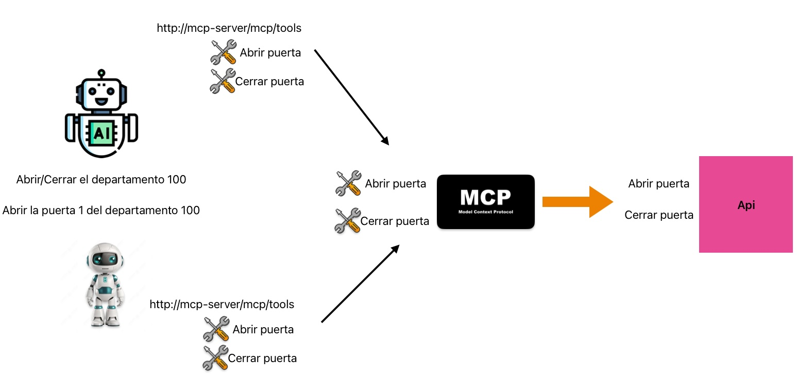

# MCP Agent + Raspberry Pi: Control de Hardware mediante Reuso de Herramientas

## Documentación
1. API [Readme](api/README.md)
2. MCP [Readme](mcp/README.md)
4. Agente [Readme](agent01/README.md)
## Diagrama

## Como iniciar
5. Ejecuta `docker-compose up -d` para levantar el API y el servidor MCP.
4. Ejecuta el agente en `agent01/`. [Readme](agent01/README.md)

## Video
🎥 ¿Quieres ver cómo funciona? Mira la explicación completa y la demo aquí: [video](https://youtu.be/UUrfqOL9G7k)
